# Jump The Queue Application

In this section we are going to explain the project structure and how to configure the project.

## Environment Configuration

You can use Pydantic Settings to handle the settings or configurations for your application, with all the power of Pydantic models. The project uses Dependency Injection for managing dependencies across the application and easy mocking for testing.

**Create an **_.env_** file for each environment configuration**. The use of @lru_cache() lets you avoid reading the dotenv file again and again for each request, while allowing you to override it during testing.

Even when using a dotenv file, the application will still read environment variables as well as the dotenv file, **environment variables will always take priority over values loaded from a dotenv file**.

You can also specify the environment when launching the server. Corresponding **_.env_** file will be automatically loaded.

Settings and environment variables are managed by **Pydantic**, refer to [the documentation](https://pydantic-docs.helpmanual.io/usage/settings/) for more info.

```
ENV=PROD uvicorn main:app --reload
ENV=PROD python main.py
```

### Host & Port Configuration
The Port and Hosting configuration can be set directly on the **.env** file if launching the main.py file.

However, this configuration is related with the uvicorn server itself and can also be set with the _**--port [int]**_ flag. 

Refer to the [uvicorn documentation](https://www.uvicorn.org/settings/) for more info.

### Logging Configuration
The application uses the default **_logging_** module.

To use it inside an specific module init it first with the command:

```
logger = logging.getLogger(__name__)
```

You can use the __name__ variable to take the current file name as the default or specify a custom module name manually.

Configure the logging properties in the **_logging.yaml_** file. 
You can find more information in the [logging](https://docs.python.org/3/library/logging.html#module-logging) documentation.

## Project Structure

Using the devon4Py framework for the Python project, we will structure our project into 3 layers:

 - **Business**: In the business layer we will store all the logic and functionality of the application, 
as well as, the definitions of all interfaces in the application.
 - **Common**: In the common layer we will store the configurations, exceptions handlers and infra settings.
 - **Domain**: The domain layer contains all the entities information and communicates with the database.


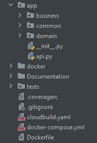


### Business layer

The business layer is divided into 3 folders:
 - Controller: The controller layer is responsible for exposing the functionality so that it
can be consumed by external entities. It manages the REST interface to the logic layer.
 - Models: In the models folder we store the DTOs and interfaces.
 - Services: The service layer is responsible for the logic business.

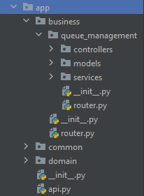


### Domain layer

The domain layer is divided into 2 sub-layers:
 - Models: In the models layer we store the entities and the database context.
 - Repositories: The respository layer is responsible for storing and retrieving some set of data from the database.

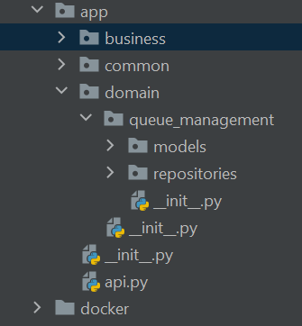


#### Entities

The Jump the Queue DataModel follows the next diagram:

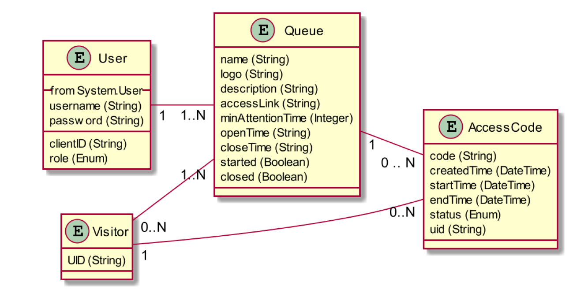

The Access Code table is represented in the app/domain/queue_management/models/access_code file using the SQLModel library:

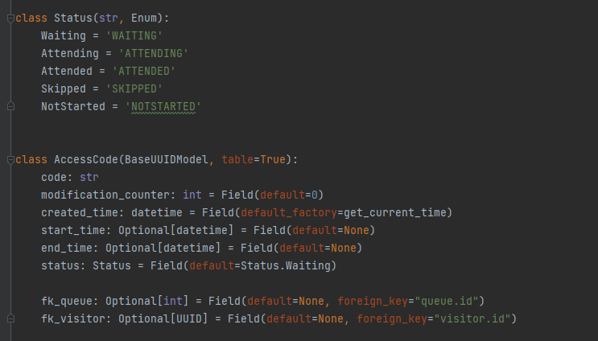

### Common layer

<!--- TODO -->
To complete

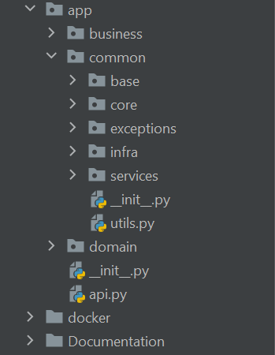


## Custom functionalities

The Jump The Queue defines a User Story in which a visitor want to see the current 
customer who is being attended.

In order to implement this functionality we should follow the next steps:
 
1. Create an endpoint.
2. Implement a method in the service layer.
3. Add methods in the repository layer.


### Creating an endpoint

First, in the app/business/queue_management/controllers/access we need to add
the following method:

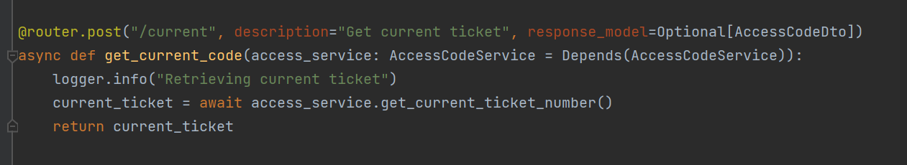

From the controller we call the Access Code service.

### Implement the logic

In the service layer app/business/queue_management/services/access we need to create
a new function called get_current_ticket_number where we will retrieve the
current customer that is being attended.

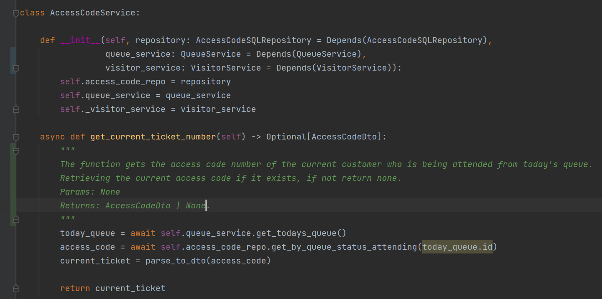

In the method we first called to the queue service layer, where we get today's current queue
and if it does not exist, we create a new one.

After that, we call to the access code repository to get the only access code with an attending status.
Finally, we parse the entity access code to a AccessCode Dto using the following function:

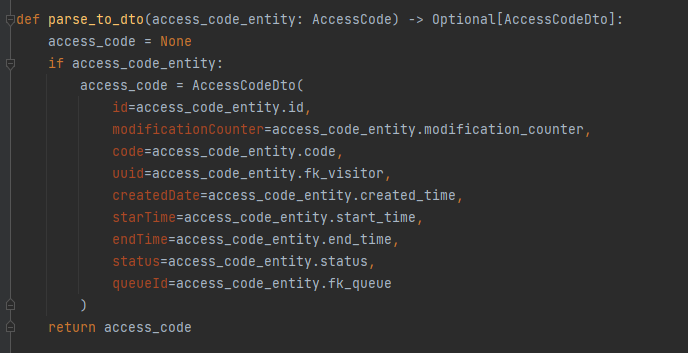

To create a Dto you need to implement the following interface:

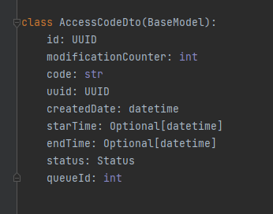

### Implement methods in repository

In the repository layer app/domain/queue_management/repositories/access_code we need to create a new method
to retrieve the access code which status is attending.

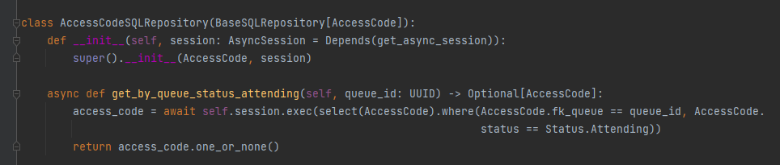