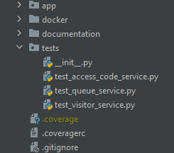
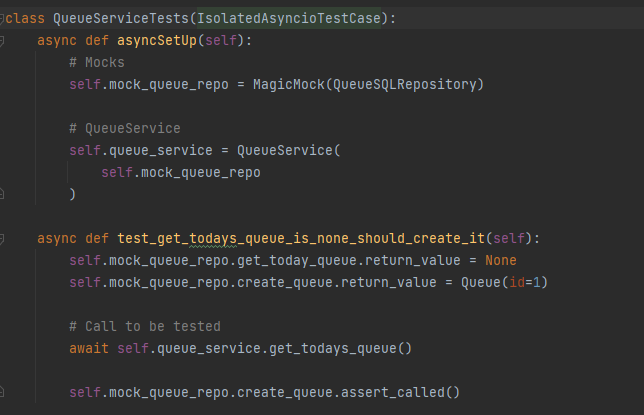

# Testing

Testing our applications is one of the most important parts of the development. 

In this chapter we are going to focus on showing some test examples, and explain briefly how to start testing our Jump the Queue project.


## Test package

In the Jump The Queue project we can find a dedicated folder for testing. We created a unit test for each
method in the service:



For now, only unit test are implemented. But in the future other tests like integration, e2e,...

### Run tests

You can run all test scenarios using:
```
python -m coverage run -m unittest
```

To display the coverage results:

```
coverage report
```

or with a nicer report as html page:

```
coverage html
```


### Example

To test our application we are using the Unittest library.

To implement a test, we mock the repository calls using the command MagicMock, and hence, we are
able to mock the return value of each repository method. Then, we call to the required service method and
we just check that the method behaviour is as expected.



